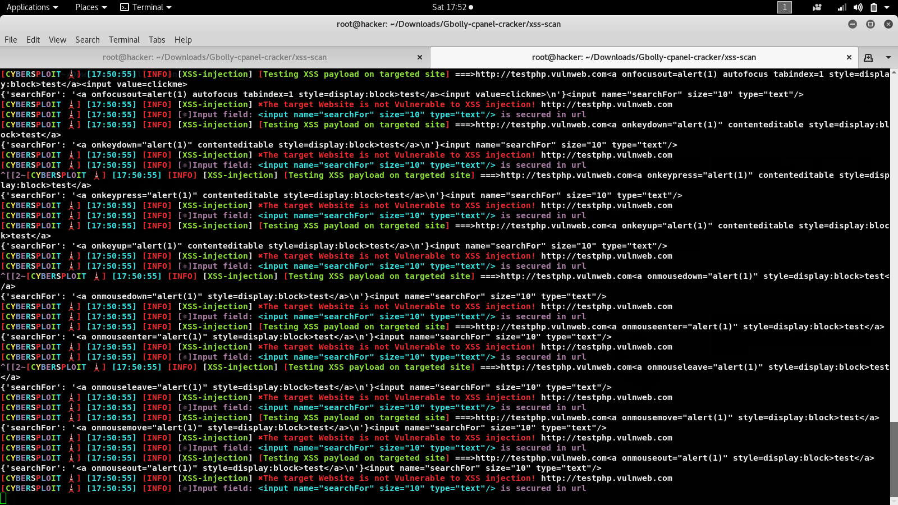

<h1 align="center">XSS-Scan🔎🔎🔎🔎</h1>
  

 A simple but very powerful XSS injection scanning tool with over 10,000+ predefined payloads 

 To check for potential XSS vulnerabilities in the user-controllable input fields, given url parameters and JS attributes
 
 It identifies and highlights the status of each input fields indicating whether it is "Vulnerable" or "Secure

 Also for vulnerable parameters thus providing information to the user about the potential security risks

 This program uses 10,000+ predefined payloads which comprises of stored, reflected and DOM payloads 

 You can also add your own payloads to the payload wordlist if you like....

## ScreenShots
 

## Screencast

**Requirements**

- Python 3.x.x
- Required Python packages: 

---------------------------------
* re
* random
* requests
* urlparse
* urllib
* BeautifulSoup
---------------------------------

## Command

  git clone https://github.com/Gbolahanomotosho/XSS-Scan

  cd XSS-Scan
 
  pip3 install -r requirements.txt
 
  python3 XSS-Scan.py

  or

  cd XSS-Scan

  chmod +x install.sh

  ./install.sh or bash install.sh

## Disclaimer: 

  For educational purpose only......
  
  

  I wont be responsible for any malicious use of this tool.......

